# NeoTechWarz
실시간 전략 시뮬레이션 게임

# 네오테크 워즈

## 게임 소개
**네오테크 워즈**는 실시간 전략(RTS) 게임으로, 인류의 생존을 건 두 거대 세력 **네오 테라 연합(NTA)**과 **오메가 코퍼레이션(OC)**의 자원 쟁탈전을 그립니다.  
싱글 플레이 환경에서 다양한 전략을 활용해 적을 물리치세요.

---

## 세계관
### 배경
21세기 말, 인류는 자원 고갈로 인해 우주로 진출했으며, 두 거대 세력 **네오 테라 연합(NTA)**과 **오메가 코퍼레이션(OC)**가 자원을 놓고 치열하게 경쟁합니다.

### 주요 세력
- **네오 테라 연합(NTA):** 민주주의와 평등을 기치로 한 연합, 방어와 균형 잡힌 전투력을 자랑.
  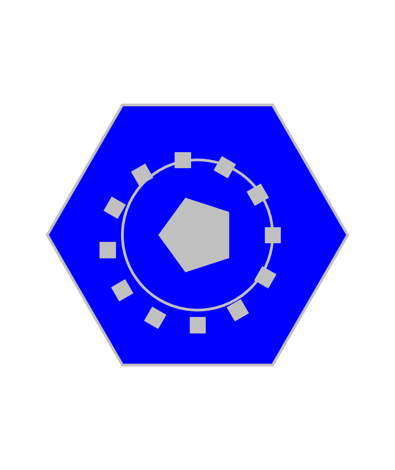
- **오메가 코퍼레이션(OC):** 자본주의와 효율성을 추구하는 기업, 강력한 화력을 기반으로 적을 압도.
  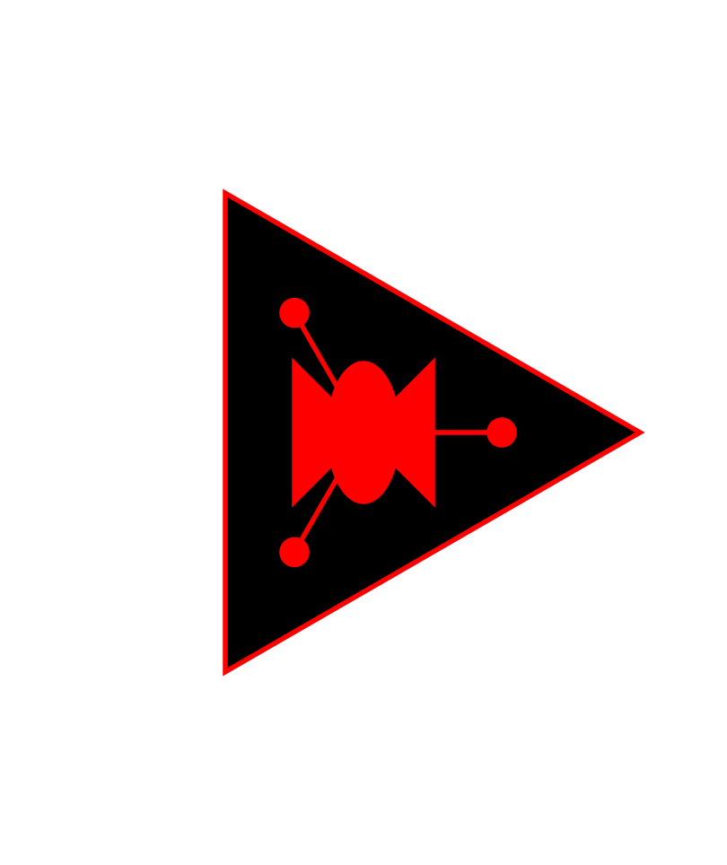

---

## 게임 진행 방식
- 각 미션을 완료하며 적군과의 전쟁을 승리로 이끌어야 합니다.
- 자원 채취, 기지 건설, 유닛 생산, 점령 시스템 등 다양한 요소를 활용합니다.

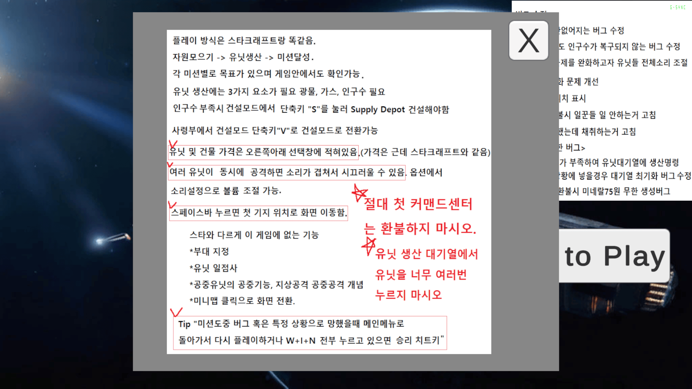

---

## 캠페인 구성
### 네오 테라 연합 (NTA)
### 1. **1미션: 새로운 시작**
   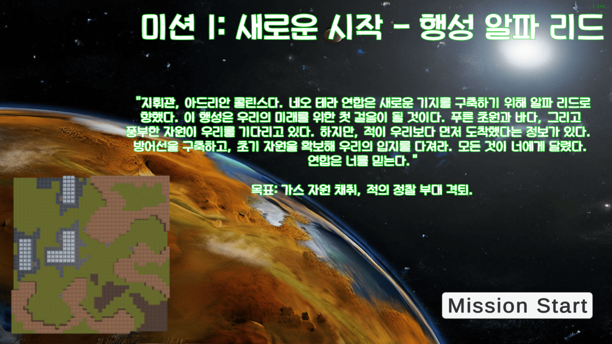
   
   - 목표: 100 가스 모으기, 적 건물 모두 부수기
   - 배경: 초원행성
  
   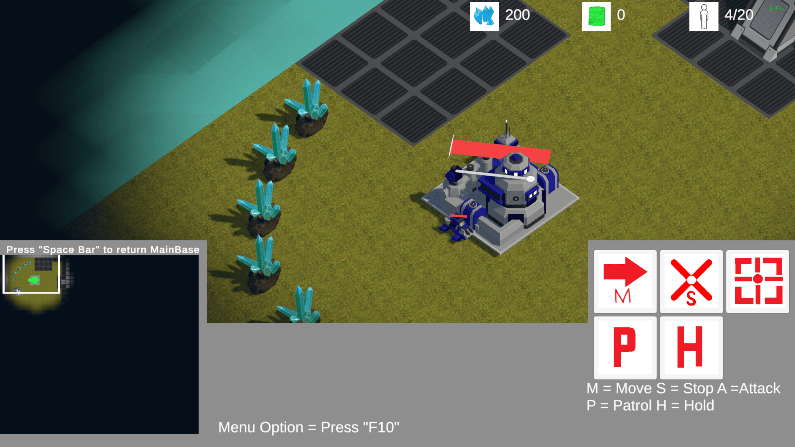

### 2. **2미션: 첫 충돌**
   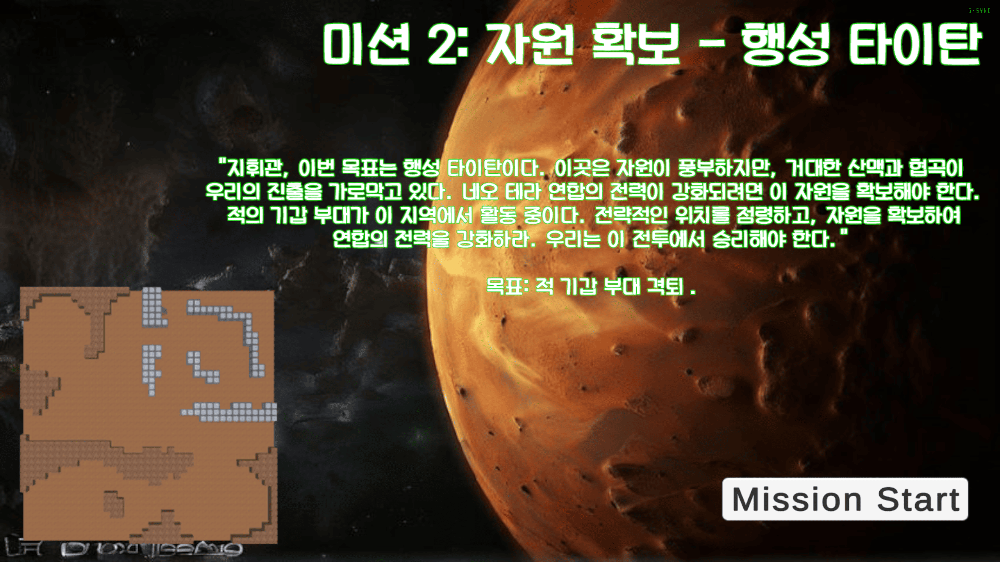
   - 목표: 적 건물 모두 부수기
   - 배경: 협곡행성

   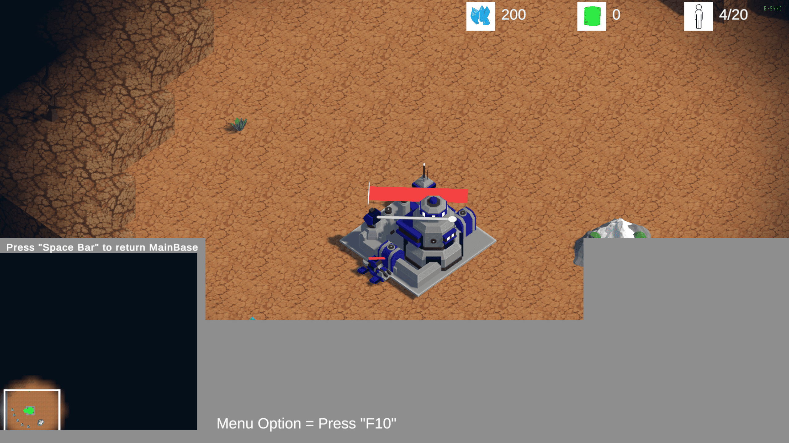

### 3. **3미션: 첨단 기술 확보**
   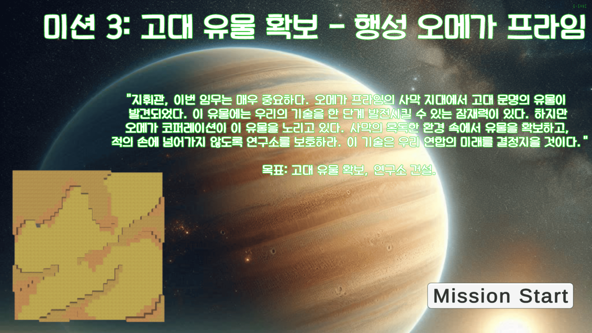
   - 목표: 유물 3개 확보, 연구소 1개 건설
   - 특수 규칙: 유물은 일꾼이 닿으면 따라다니며, 일꾼이 없어질 경우 원래 자리로 돌아감.
   - 배경: 사막행성

   

### 4. **4미션: 반격 준비**
   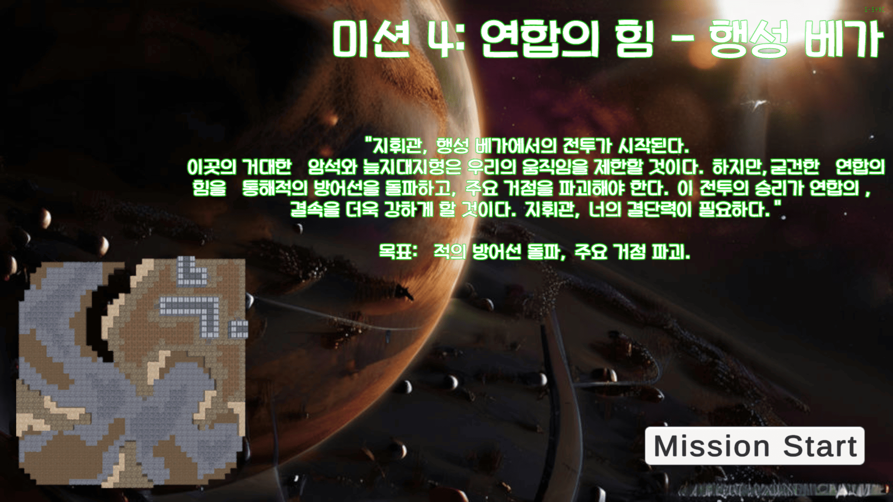
   - 목표: 적 건물 모두 부수기
   - 배경: 암석 행성

   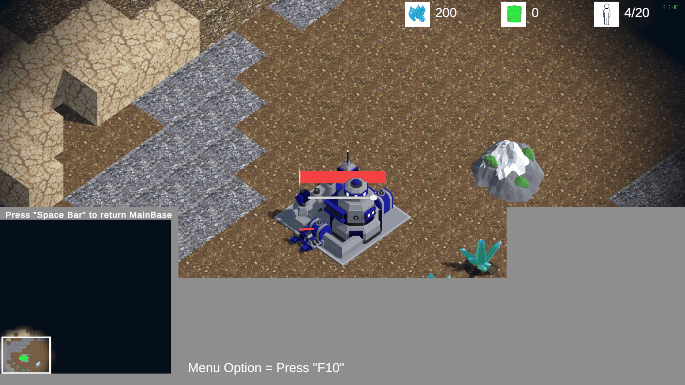

### 5. **5미션: 최후의 결전**
    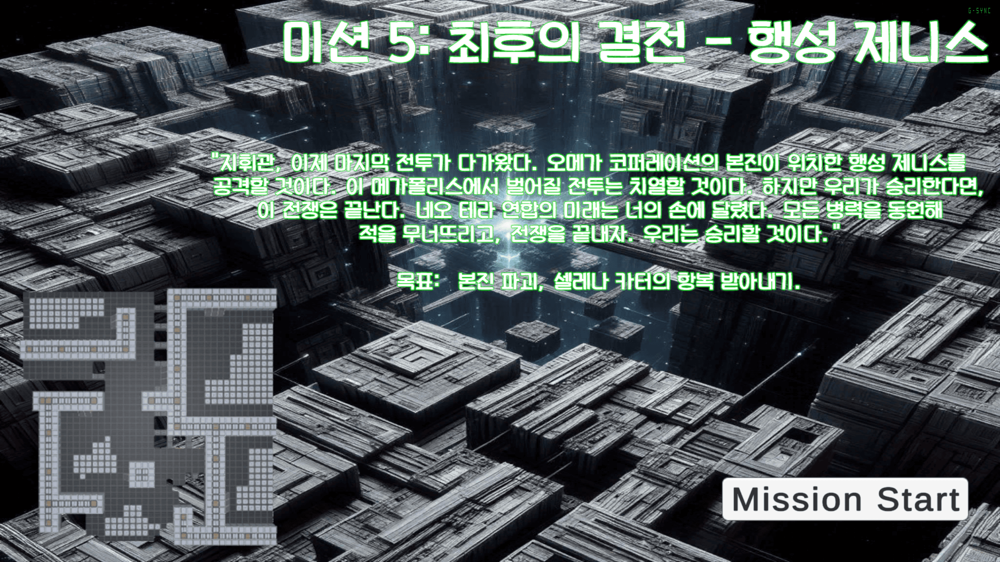
   - 목표: 적 사령부 부수기
   - 배경: 도시행성  

   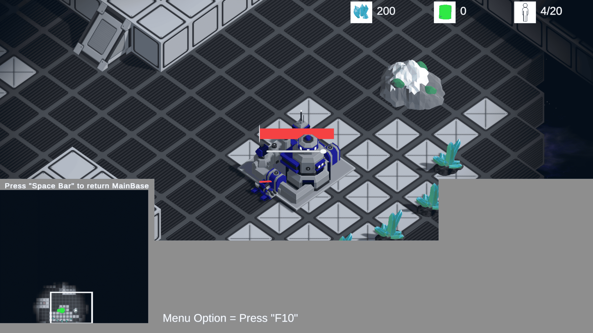
##
### 오메가 코퍼레이션 (OC)
1. **1미션: 기업의 야망**
   - 목표: 200 미네랄 모으기, 100 가스 모으기
   - 배경: 용암행성
2. **2미션: 강력한 첫 공격**
   - 목표: 미네랄 500 모으기, 적 건물 모두 부수기
   - 배경: 검은대지 불모 행성 (자원 매우 희귀)
3. **3미션: 기술 혁신**
   - 목표: 고대 유물 재단 확보, 연구소 1개 건설
   - 배경: 사막행성
4. **4미션: 결정적 타격**
   - 목표: 적 건물 모두 부수기
   - 배경: 초원행성
5. **5미션: 최후의 공격**
   - 목표: 적 사령부 부수기
   - 배경: 우주정거장 행성  
     ※ Skybox 우주 활용

---

## 게임 기능
### 조작
- **유닛 선택 및 명령**
  - **좌클릭:** 유닛 선택
  - **Shift + 좌클릭:** 선택 해제/추가
  - **우클릭:** 이동 및 공격
  - **더블클릭:** 동일한 유닛 모두 선택
- **명령 단축키**
  - **A:** 공격 모드 → 좌클릭으로 목표 지정
  - **S:** 정지
  - **P:** 순찰 모드 → 좌클릭으로 경로 지정
  - **H:** 홀드 → 적이 나타나도 따라가지 않음

### 카메라 이동
- **방향키:** 화면 이동
- **휠:** 줌 인/아웃
- **화면 끝 도달:** 해당 방향으로 화면 이동

### 시스템
- **자원 채취**
  - 유닛이 자원으로 이동해 일정 시간 채취 후 가장 가까운 기지로 귀환
- **점령 시스템**
  - 특정 범위 내 30초 동안 유지 시 점령
  - 점령 상태 색상 표시 (중립 → 파랑/빨강 → 중립)
- **건물 건설**
  - 점령된 거점 주변으로 건물을 지을수 있습니다.
  - 건물이 이미 지어진 곳에는 건물을 겹쳐 지을 수 없습니다.
- **유닛 생산**
  - 건물(여왕)이 일정 시간마다 선택된 유닛 생산
  - 생산 유닛 교체 가능

---

## 주요 시스템
### 자원 시스템
- 자원 UI: **식량**, **건설 자원**
- 생산 활동: 대기열 기반 생산 시스템

### 점령 시스템
- 점령된 지역에만 건물 건설 가능
- 점령 상태가 전투의 흐름에 중요한 영향을 미침

---

## 기타
- 자세한 정보와 이미지는 제작 중인 게임 매뉴얼에서 추가 제공 예정입니다.
